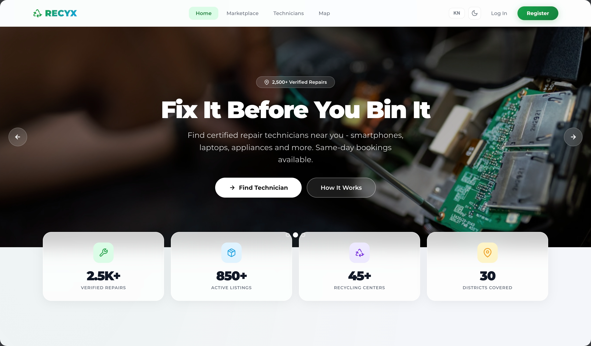
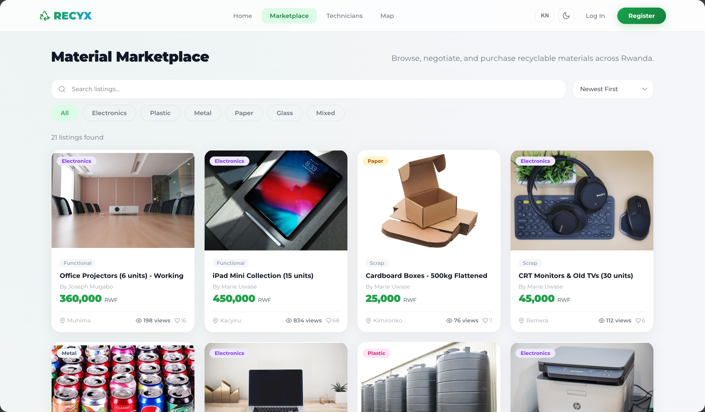
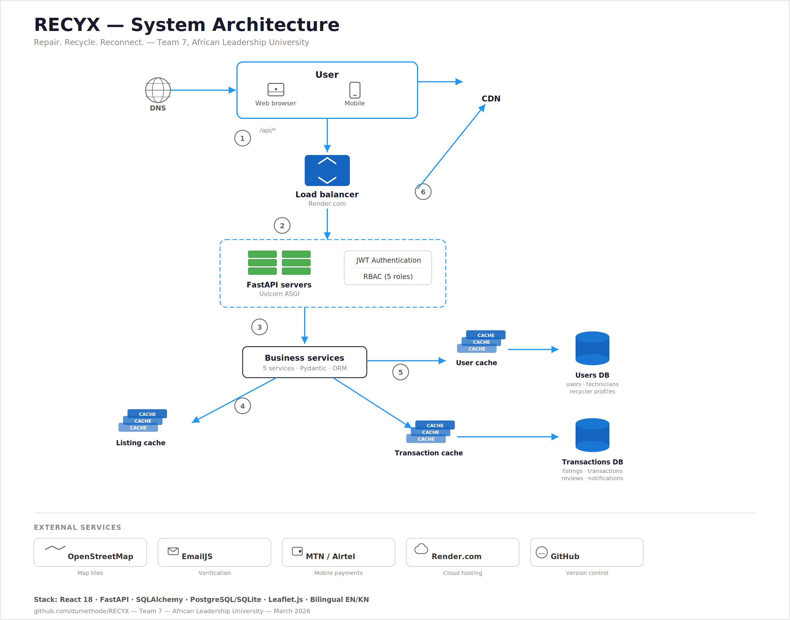
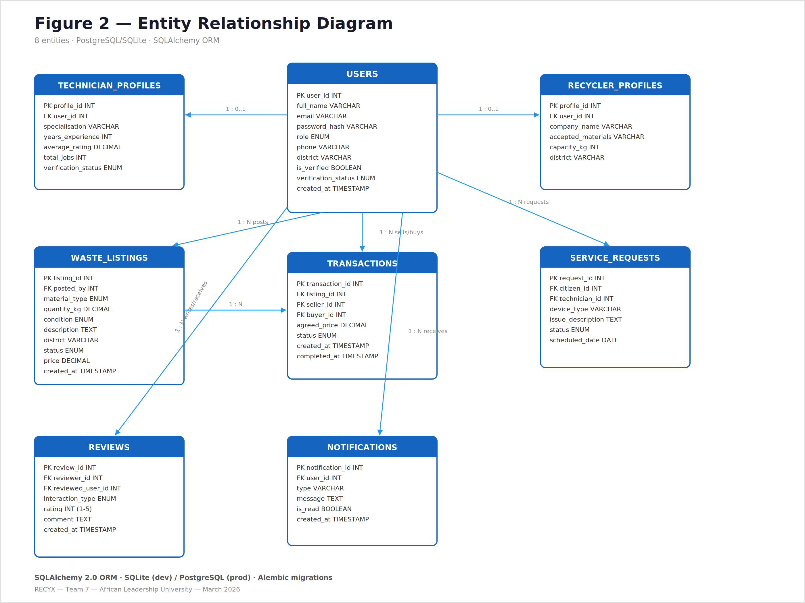
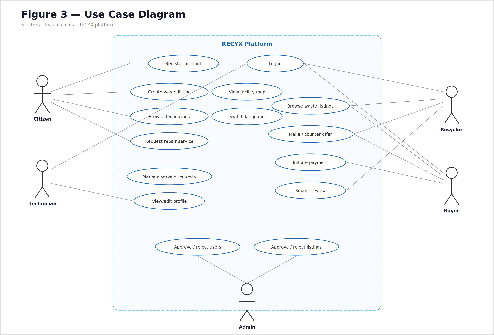
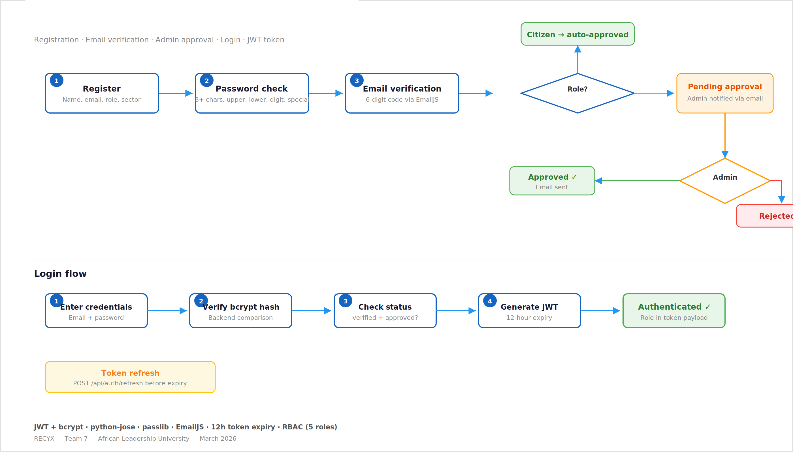
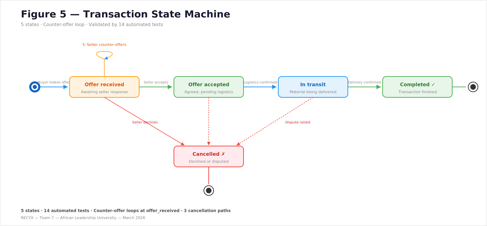
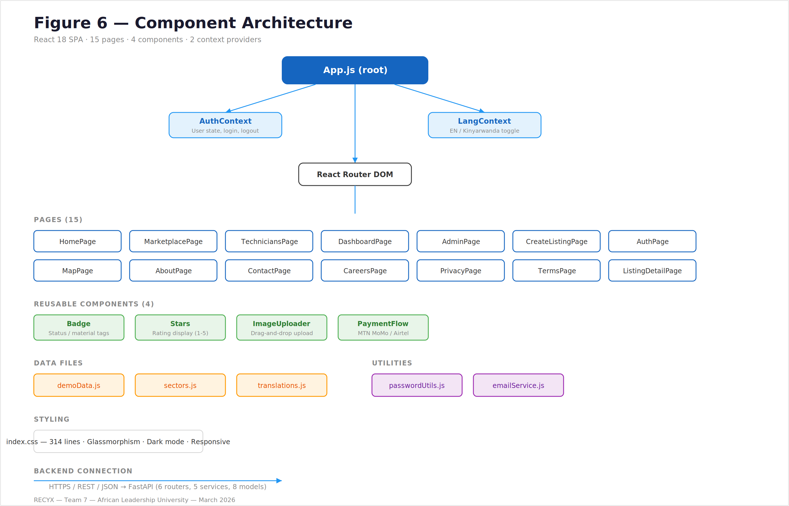

# RECYX — Repair. Recycle. Reconnect.

A full-stack web platform bridging Rwanda's circular economy gap by connecting device owners, certified technicians, recyclers, and buyers through a single coordinated marketplace.


**Team 7**: Keira Mutoni | Nawaf Ahmed | Sylivie Tumukunde | Methode Duhujubumwe | Nicole Rhoda Umutesi | Cindy Saro Teta

---

## Submission

- **Final Report**: [View Document](https://docs.google.com/document/d/1IrO0pi2EdKkpULEeGcoexlje2i5OZSbi/edit?usp=sharing&ouid=104839120287500249492&rtpof=true&sd=true)
- **Video Walkthrough**: [Watch Demo](https://www.youtube.com/@CindyTeta-j2v)
- **Poster Presentation**: [View Poster](https://drive.google.com/file/d/1O0enN-p9Gn4iSYrQSKCGJR9ZrDJCaza2/view?usp=sharing)
- **Team Task Sheet**: [Team Participation Sheet](https://docs.google.com/spreadsheets/d/1P65ywy6u-HvgZxhNEx5wjJRjT7cd-Hp1wrEbziRuIS8/edit?usp=drivesdk&authuser=2)
- **Complete Package**: [Download Zip](https://drive.google.com/file/d/1dRxkngAXYnE_ih_snMgapglXDaMYtmUx/view?usp=sharing)
- **Live Demo**: [https://recyx.netlify.app/](https://recyx.netlify.app/)

**Note**: The live site displays the full user interface with demo data. For complete backend functionality with a real database, follow the local installation instructions below.

---

## Table of Contents

- [Features](#features)
- [System Architecture](#system-architecture)
- [Tech Stack](#tech-stack)
- [Prerequisites](#prerequisites)
- [Installation](#installation)
- [Running the Application](#running-the-application)
- [Demo Credentials](#demo-credentials)
- [Project Structure](#project-structure)
- [API Documentation](#api-documentation)
- [Transaction State Machine](#transaction-state-machine)
- [Platform Insights](#platform-insights)
- [Screenshots](#screenshots)
- [Diagrams](#diagrams)
- [Troubleshooting](#troubleshooting)
- [Team Contributions](#team-contributions)

---

## Features

### Marketplace & Listings
- Create, browse, and manage e-waste and device listings
- Admin approval workflow before listings go live
- Advanced filtering by material type, condition, district, and price
- Favorites/saved listings system
- 22 pre-seeded demo listings across Rwanda

### Technician Directory
- Discover and contact certified repair technicians
- Filter by device type and district (all 30 Rwanda districts with sectors)
- Structured service request workflow with status tracking
- Ratings and feedback system for completed repairs
- 16 pre-seeded demo technician profiles

### Transaction System
- Offer-based negotiation between buyers and sellers
- Validated state machine enforcing legal status transitions
- Mobile money payment integration (MTN MoMo, Airtel Money)
- Full transaction history and status tracking

### Admin Panel
- User verification and approval workflows
- Platform-wide analytics dashboard
- Listing moderation (approve/reject with reason)
- Pending user management with role context

### Additional Platform Features
- Role-based access control (5 roles: citizen, technician, recycler, buyer, admin)
- Bilingual interface (English & Kinyarwanda)
- Interactive Leaflet map with 15 verified recycling facilities across Rwanda
- JWT authentication with refresh token support
- 103 automated tests (59 backend + 44 frontend)
- Responsive design for mobile and desktop

---

## System Architecture

Our application uses a three-tier architecture separating concerns between presentation, business logic, and data storage.

```
┌───────────────────────────────────────┐
│        FRONTEND (Port 3000)           │
│     React 18 + React Router DOM       │
│   Leaflet Maps | Bilingual (EN/RW)    │
└──────────────┬────────────────────────┘
               │
        HTTP/JSON Requests
        JWT Bearer Tokens
               │
┌──────────────▼────────────────────────┐
│         BACKEND (Port 8000)           │
│       FastAPI + Uvicorn ASGI          │
│  8 Routers | 30+ Endpoints | RBAC     │
│  Transaction State Machine | JWT Auth │
└──────────────┬────────────────────────┘
               │
          SQLAlchemy ORM
               │
┌──────────────▼────────────────────────┐
│           DATABASE                    │
│  SQLite (dev) | PostgreSQL (prod)     │
│  8 Models | Alembic Migrations        │
└───────────────────────────────────────┘
```

**See detailed diagrams**: [Diagrams Section](#diagrams)

---

## Tech Stack

### Backend
- **Python 3.11+** — Core language
- **FastAPI 0.109+** — REST API framework with auto-generated docs
- **SQLAlchemy 2.0** — ORM with async support
- **SQLite** — Development database (zero setup)
- **PostgreSQL + PostGIS** — Production database
- **Alembic 1.13** — Database migrations
- **Python-Jose** — JWT token generation and validation
- **Passlib + Bcrypt** — Password hashing
- **Pydantic 2.5** — Data validation and schemas
- **Pytest** — Testing framework (59 tests)

### Frontend
- **React 18.2** — UI library
- **React Router DOM 6.22** — Client-side routing (15 pages)
- **Leaflet 1.9 + React Leaflet** — Interactive map visualizations
- **EmailJS 4.1** — Transactional email (contact/verification)
- **Jest + React Testing Library** — Testing (44 tests)

### Deployment
- **Netlify** — Frontend hosting (CI/CD via netlify.toml)
- **Render** — Backend hosting (render.yaml configured)

### External Services
- **MTN Mobile Money** — Payment integration
- **Airtel Money** — Payment integration
- **OpenStreetMap** — Map tiles for facility map
- **EmailJS** — Email notifications

### Design System
- **Colors**: Green (#16a34a), Teal accents for sustainability theme
- **Typography**: System font stack
- **Layout**: Responsive grid, mobile-first

---

## Prerequisites

Before installation, ensure you have:

- **Node.js 18 or higher**
  ```bash
  node --version  # Should show 18.0.0 or higher
  npm --version
  ```

- **Python 3.11 or higher**
  ```bash
  python3 --version  # Should show 3.11.0 or higher
  pip3 --version
  ```

- **Git**
  ```bash
  git --version
  ```

- **200 MB free disk space** for dependencies and database

---

## Installation

### Quick Start (Using Pre-built Package)

**Fastest method** — Download our pre-configured package:

1. **Download** the complete project package: [Download Zip](https://drive.google.com/file/d/1dRxkngAXYnE_ih_snMgapglXDaMYtmUx/view?usp=sharing)

2. **Extract** the zip file to your desired location

3. **Set up the backend** (Terminal 1):
   ```bash
   cd RECYX/backend
   python3 -m venv venv
   source venv/bin/activate       # Mac/Linux
   # OR: venv\Scripts\activate    # Windows
   pip install -r requirements.txt
   ```

4. **Set up the frontend** (Terminal 2):
   ```bash
   cd RECYX/frontend
   npm install
   ```

5. **Run** — follow the [Running the Application](#running-the-application) section below.

---

### Manual Installation (From Source)

#### Step 1: Clone Repository

```bash
git clone https://github.com/nwafawad/foundationsproject.git
cd foundationsproject
```

#### Step 2: Set Up Backend

```bash
cd backend

# Create virtual environment
python3 -m venv venv

# Activate virtual environment
source venv/bin/activate    # Mac/Linux
# OR
venv\Scripts\activate       # Windows

# You should see (venv) in your terminal prompt

# Install dependencies
pip install -r requirements.txt
```

#### Step 3: Configure Backend Environment

Create a `.env` file inside the `backend/` directory:

```bash
cp .env.example .env
```

The default `.env` for local development (SQLite, no changes needed):

```env
APP_ENV=development
DATABASE_URL=sqlite:///./recyx.db
SECRET_KEY=dev-secret-key-change-in-production-recyx-2024
ALGORITHM=HS256
ACCESS_TOKEN_EXPIRE_HOURS=12
APP_HOST=0.0.0.0
APP_PORT=8000
FRONTEND_URL=http://localhost:3000
```

**No database setup required** — SQLite creates `recyx.db` automatically on first run.

#### Step 4: Set Up Frontend

```bash
cd ../frontend

# Install dependencies
npm install
```

#### Step 5: Configure Frontend Environment

Create a `.env` file inside the `frontend/` directory:

```bash
cp .env.example .env
```

Default `.env` for local development:

```env
REACT_APP_API_URL=http://localhost:8000
REACT_APP_EMAILJS_SERVICE_ID=your_service_id
REACT_APP_EMAILJS_PUBLIC_KEY=your_public_key
REACT_APP_ADMIN_EMAIL=m.duhujubum@alustudent.com
```

**Note**: EmailJS keys are only needed for the contact form. All other features work without them.

---

## Running the Application

### Start Backend Server

**Terminal 1**:
```bash
cd backend
source venv/bin/activate    # If not already active
uvicorn app.main:app --reload --host 0.0.0.0 --port 8000
```

**Expected output**:
```
INFO:     Uvicorn running on http://0.0.0.0:8000 (Press CTRL+C to quit)
INFO:     Started reloader process
INFO:     Started server process
INFO:     Waiting for application startup.
INFO:     Application startup complete.
```

The backend auto-seeds demo data (users, listings, technicians) on first startup.

**Interactive API Docs** (auto-generated by FastAPI):
```
http://localhost:8000/docs      ← Swagger UI
http://localhost:8000/redoc     ← ReDoc
```

**Keep this terminal running!**

### Start Frontend Server

**Terminal 2** (new window):
```bash
cd frontend
npm start
```

**Expected output**:
```
Compiled successfully!

You can now view recyx in the browser.

  Local:            http://localhost:3000
  On Your Network:  http://192.168.x.x:3000
```

### Access Application

Open your browser and navigate to:
```
http://localhost:3000
```

**You should see**:
- Homepage with hero section and platform overview
- Navigation to Marketplace, Technicians, and Map
- Login/Register for full platform access
- Use the [Demo Credentials](#demo-credentials) below to explore role-specific features

### Run Tests

**Backend tests** (59 tests):
```bash
cd backend
source venv/bin/activate
pytest -v
```

**Frontend tests** (44 tests):
```bash
cd frontend
npm test -- --watchAll=false --verbose
```

---

## Demo Credentials

Use these pre-seeded accounts to explore all platform roles:

| Role | Email | Password | Access |
|------|-------|----------|--------|
| **Admin** | admin@recyx.rw | Admin@123 | Full admin panel, user verification, analytics |
| **Technician** | bernard@email.com | Bernard@1 | Technician profile, service requests |
| **Recycler** | claudine@green.rw | Claudine1! | Recycler profile, listing management |
| **Technician** | emmanuel@email.com | Emmanuel1! | Technician profile, service requests |

**Verification Code**: `000000` (used during registration email verification step)

**Pending accounts** (visible in Admin panel for approval demo):
- Bernard Twagiramungu — Technician
- Claudine Nyirahabimana — Recycler
- Emmanuel Rugamba — Technician

---

## Project Structure

```
RECYX/
├── backend/
│   ├── app/
│   │   ├── main.py                   # FastAPI entry point, CORS, startup
│   │   ├── config.py                 # Pydantic settings (env vars)
│   │   ├── database.py               # SQLAlchemy engine & session
│   │   ├── seed.py                   # Demo data seeding
│   │   ├── models/
│   │   │   └── models.py             # 8 ORM models + enums
│   │   ├── schemas/
│   │   │   └── schemas.py            # Pydantic request/response schemas
│   │   ├── routers/
│   │   │   ├── auth.py               # Register, login, refresh, profile
│   │   │   ├── technicians.py        # Technician search & service requests
│   │   │   ├── listings.py           # Marketplace listings & favorites
│   │   │   ├── transactions.py       # Offer negotiation & state machine
│   │   │   ├── reviews.py            # Ratings and feedback
│   │   │   ├── admin.py              # Verification workflows & analytics
│   │   │   ├── facilities.py         # Recycling facility map data
│   │   │   └── notifications.py      # User notifications
│   │   ├── services/
│   │   │   ├── auth_service.py
│   │   │   ├── technician_service.py
│   │   │   ├── listing_service.py
│   │   │   ├── transaction_service.py
│   │   │   └── admin_service.py
│   │   └── middleware/
│   │       └── auth.py               # JWT validation + RBAC enforcement
│   ├── tests/
│   │   ├── conftest.py               # Pytest fixtures
│   │   ├── test_auth_service.py
│   │   ├── test_models.py
│   │   ├── test_schemas.py
│   │   └── test_transaction_state_machine.py
│   ├── requirements.txt              # Full dependency list
│   ├── requirements-render.txt       # Production (Render) dependencies
│   ├── .env.example                  # Environment variable template
│   ├── recyx.db                      # SQLite database (auto-created)
│   └── render.yaml                   # Render deployment config
│
├── frontend/
│   ├── public/
│   │   └── favicon.svg
│   └── src/
│       ├── App.js                    # Routing (15 pages)
│       ├── components/
│       │   ├── Navbar.jsx
│       │   ├── Footer.jsx
│       │   ├── Badge.jsx             # Status/material badges
│       │   ├── Stars.jsx             # Rating component
│       │   ├── Toast.jsx             # Notification toasts
│       │   ├── ImageUploader.jsx     # Drag-and-drop image upload
│       │   └── PaymentFlow.jsx       # MTN/Airtel Money UI
│       ├── context/
│       │   ├── AuthContext.js        # Authentication state
│       │   └── LangContext.js        # EN/Kinyarwanda switching
│       ├── pages/
│       │   ├── HomePage.jsx
│       │   ├── MarketplacePage.jsx   # 22 demo listings
│       │   ├── CreateListingPage.jsx
│       │   ├── TechniciansPage.jsx   # 16 demo technicians
│       │   ├── DashboardPage.jsx
│       │   ├── AdminPage.jsx
│       │   ├── MapPage.jsx           # Leaflet, 15 facilities
│       │   └── ...                   # 8 more pages
│       ├── data/
│       │   ├── demoData.js           # 22 listings, 16 technicians
│       │   ├── sectors.js            # All 30 Rwanda districts
│       │   └── translations.js       # EN/Kinyarwanda strings
│       ├── utils/
│       │   ├── api.js                # API client
│       │   ├── mockService.js        # Demo/offline mode service
│       │   └── passwordUtils.js      # Strength meter + validation
│       └── tests/
│           └── integration.test.js   # 44 integration tests
│
├── Screenhots/                        # UI screenshots and diagrams
│   ├── Homepage.png
│   ├── Marketplace.png
│   ├── Buyer - Offer.png
│   ├── Technicians Page.png
│   ├── Admin Panel PAGE.png
│   ├── recyx_system_architecture.png
│   ├── fig2-erd.png
│   ├── fig3-usecase.png
│   ├── fig4-auth.png
│   ├── fig5-transaction.png
│   └── fig6-components.png
│
├── DEMO-CREDENTIALS.md               # Login credentials for demo accounts
├── TESTING.md                        # Step-by-step testing guide
├── FINAL_REPORT.md                   # Complete academic project report
├── netlify.toml                      # Netlify frontend deployment config
└── README.md                         # This file
```

---

## API Documentation

**Base URL (local)**: `http://localhost:8000`

**Interactive docs**: `http://localhost:8000/docs` (Swagger UI, auto-generated by FastAPI)

### Authentication Endpoints (`/api/auth`)

#### 1. Register New User
```http
POST /api/auth/register
```

**Body**:
```json
{
  "name": "Jean Bosco",
  "email": "jean@example.com",
  "password": "Secure@123",
  "role": "citizen",
  "phone": "+250788000000",
  "district": "Kicukiro"
}
```

**Response**:
```json
{
  "id": 1,
  "name": "Jean Bosco",
  "email": "jean@example.com",
  "role": "citizen",
  "verification_status": "pending"
}
```

#### 2. Login
```http
POST /api/auth/login
```

**Body**:
```json
{
  "email": "jean@example.com",
  "password": "Secure@123"
}
```

**Response**:
```json
{
  "access_token": "eyJ...",
  "refresh_token": "eyJ...",
  "token_type": "bearer"
}
```

#### 3. Get Current User Profile
```http
GET /api/auth/me
Authorization: Bearer <token>
```

#### 4. Refresh Token
```http
POST /api/auth/refresh
```

---

### Listings Endpoints (`/api/listings`)

#### 5. Create Listing
```http
POST /api/listings
Authorization: Bearer <token>
```

**Body**:
```json
{
  "title": "Old Laptop - Dell Inspiron",
  "description": "5 years old, screen cracked but boots fine",
  "material_type": "electronics",
  "condition": "repairable",
  "quantity_kg": 2.5,
  "price": 15000,
  "district": "Gasabo"
}
```

#### 6. Search Listings
```http
GET /api/listings?material_type=electronics&condition=repairable&district=Gasabo&limit=20&offset=0
```

**Query Parameters**:
- `material_type`: electronics, plastic, metal, paper, glass, mixed, other
- `condition`: functional, repairable, scrap
- `district`: Any of 30 Rwanda districts
- `min_price` / `max_price`: Price range filter
- `limit` / `offset`: Pagination

#### 7. Get Saved Listings
```http
GET /api/listings/favorites
Authorization: Bearer <token>
```

---

### Technicians Endpoints (`/api/technicians`)

#### 8. Search Technicians
```http
GET /api/technicians?device_type=laptop&district=Kicukiro
```

**Query Parameters**:
- `device_type`: Repair specialization keyword
- `district`: Any of 30 Rwanda districts

#### 9. Create Service Request
```http
POST /api/technicians/service-requests
Authorization: Bearer <token>
```

**Body**:
```json
{
  "technician_id": 3,
  "device_description": "Laptop won't turn on after water damage",
  "preferred_date": "2026-04-10"
}
```

#### 10. Update Service Request Status
```http
PATCH /api/technicians/service-requests/{request_id}/status
Authorization: Bearer <token>
```

---

### Transactions Endpoints (`/api/transactions`)

#### 11. Submit Offer
```http
POST /api/transactions
Authorization: Bearer <token>
```

**Body**:
```json
{
  "listing_id": 5,
  "offer_amount": 12000,
  "message": "Interested, can we negotiate?"
}
```

#### 12. Update Transaction Status (State Machine)
```http
PATCH /api/transactions/{transaction_id}/status
Authorization: Bearer <token>
```

**Body**:
```json
{
  "status": "offer_accepted"
}
```

**Valid transitions**: See [Transaction State Machine](#transaction-state-machine)

---

### Admin Endpoints (`/api/admin`)

#### 13. Get Platform Statistics
```http
GET /api/admin/stats
Authorization: Bearer <admin-token>
```

**Response**:
```json
{
  "total_users": 47,
  "pending_verifications": 3,
  "total_listings": 22,
  "pending_listings": 4,
  "completed_transactions": 11
}
```

#### 14. Verify User
```http
POST /api/admin/verify-user/{user_id}
Authorization: Bearer <admin-token>
```

#### 15. Reject User
```http
POST /api/admin/reject-user/{user_id}
Authorization: Bearer <admin-token>
```

---

### Other Endpoints

```http
GET /api/facilities           # 15 recycling facilities with coordinates
GET /api/notifications        # User notifications (auth required)
GET /api/reviews              # Reviews for technicians/transactions
POST /api/reviews             # Submit a review (auth required)
GET /health                   # Health check — returns {"status": "ok"}
```

---

## Transaction State Machine

### Overview

One of RECYX's core technical achievements is the **validated transaction state machine** implemented in `backend/app/routers/transactions.py` and thoroughly tested in `backend/tests/test_transaction_state_machine.py`.

Every offer on the platform moves through a defined lifecycle. The state machine enforces that **only legal transitions are permitted**, preventing invalid state jumps (e.g., moving directly from `offer_received` to `completed` without acceptance or transit).

### State Transition Diagram

```
offer_received
      │
      ├──[accept]──► offer_accepted
      │                    │
      └──[cancel]──►  cancelled    [cancel]──► cancelled
                           │
                      [in_transit]
                           │
                       in_transit
                           │
                       [complete]
                           │
                        completed
```

### Valid Transitions

| Current Status | Allowed Next Status | Actor |
|----------------|---------------------|-------|
| `offer_received` | `offer_accepted` | Seller |
| `offer_received` | `cancelled` | Buyer or Seller |
| `offer_accepted` | `in_transit` | Seller |
| `offer_accepted` | `cancelled` | Buyer or Seller |
| `in_transit` | `completed` | Buyer |
| `completed` | *(terminal — no transitions)* | — |
| `cancelled` | *(terminal — no transitions)* | — |

### Implementation

The state machine is defined as a dictionary mapping each status to its allowed next states:

```python
VALID_TRANSITIONS = {
    "offer_received": ["offer_accepted", "cancelled"],
    "offer_accepted": ["in_transit", "cancelled"],
    "in_transit":     ["completed"],
    "completed":      [],
    "cancelled":      [],
}
```

Any attempt to transition to an unlisted next state returns `HTTP 400` with a clear error message — ensuring data integrity across all transaction flows.

### Complexity

- **Time Complexity**: O(1) — dictionary lookup for valid transitions
- **Space Complexity**: O(S) — where S is the number of states (5)
- **Test Coverage**: All transition paths covered in `test_transaction_state_machine.py`

---

## Platform Insights

### Rwanda's E-Waste Problem

**Context**: Rwanda generates approximately **17,000 tonnes of e-waste annually**, with no coordinated digital marketplace to facilitate repair, resale, or responsible recycling. RECYX directly addresses this gap.

### Key Design Decisions

#### 1. Role-Based Access Control (5 Roles)

**Finding**: A single user type cannot serve Rwanda's diverse circular economy actors.

**Design**:
- **Citizen** — Can list devices and request repairs
- **Technician** — Can receive service requests and manage repair jobs
- **Recycler** — Can manage waste collection listings
- **Buyer** — Can browse marketplace and submit offers
- **Admin** — Full platform oversight with verification authority

**Impact**: Each role sees a tailored interface with only the actions relevant to them, reducing friction and preventing unauthorized operations.

#### 2. Bilingual Support (English & Kinyarwanda)

**Finding**: Rwanda's official languages include Kinyarwanda, and many platform users in rural districts are more comfortable in their native language.

**Implementation**: A `LangContext` provider toggles all UI strings between English and Kinyarwanda at runtime — no page reload required. Translation strings live in `frontend/src/data/translations.js`.

**Impact**: Reduces the digital literacy barrier for citizens in non-urban districts.

#### 3. Admin Approval Workflow

**Finding**: An unmoderated marketplace risks fake listings and unverified technicians undermining trust.

**Design**: Every new listing enters `pending_review` status and every new technician/recycler account enters `pending` verification — neither is visible to other users until an admin approves.

**Impact**: Ensures quality control and platform trust, especially critical for a marketplace handling financial transactions.

---

## Screenshots

### Homepage



*Hero section with platform overview, call-to-action, and navigation to Marketplace, Technicians, and Map*

### Marketplace



*22 demo listings with filtering by material type, condition, and district — each card shows price, condition badge, and location*

### Offer Negotiation


*Buyer submitting an offer on a listing — the offer enters the transaction state machine as `offer_received`*

### Technicians Directory


*16 verified technician profiles searchable by device type and district — each profile shows specialization, rating, and availability*

### Admin Panel


*Admin dashboard with platform analytics, pending user verifications, and listing moderation queue*

---

## Diagrams

### System Architecture



*Three-tier architecture: React frontend → FastAPI backend → SQLite/PostgreSQL database, with RBAC middleware and JWT authentication layer*

### Entity-Relationship Diagram (ERD)



*8 database models: User, TechnicianProfile, RecyclerProfile, WasteListing, Transaction, ServiceRequest, Review, Notification — with foreign key relationships*

### Use Case Diagram



*All 5 user roles and their allowed platform interactions — Citizens, Technicians, Recyclers, Buyers, and Admins*

### Authentication Flow



*3-step registration flow: account creation → email verification (code 000000) → admin approval before full platform access*

### Transaction State Machine



*Full lifecycle of a marketplace transaction from `offer_received` through `offer_accepted`, `in_transit`, to `completed` or `cancelled`*

### Component Architecture



*Frontend component hierarchy: App → AuthContext/LangContext → 15 pages → shared components (Navbar, Badge, Stars, Toast, PaymentFlow)*

---

## Troubleshooting

### Backend Issues

#### "ModuleNotFoundError: No module named 'fastapi'"

**Solution**:
```bash
# Activate virtual environment
source venv/bin/activate    # Mac/Linux
venv\Scripts\activate       # Windows

# Verify you're in the right environment
which python3

# Reinstall if missing
pip install -r requirements.txt
```

#### "Address already in use (port 8000)"

**Solution**:
```bash
# Option 1: Kill process on port 8000
lsof -ti:8000 | xargs kill -9

# Option 2: Run on a different port
uvicorn app.main:app --reload --port 8001
# Then update frontend/.env:
# REACT_APP_API_URL=http://localhost:8001
```

#### "Database is locked"

**Solution**:
```bash
# Close any SQLite browser tools open on recyx.db
# Restart the Uvicorn server
# If the problem persists, reset the database:
rm backend/recyx.db
uvicorn app.main:app --reload   # Re-seeds automatically on next start
```

#### "CORS error in browser console"

**Solution**:
```bash
# Verify backend is running
curl http://localhost:8000/health
# Should return: {"status": "ok"}

# Check that FRONTEND_URL in backend/.env matches your frontend URL
# Default: FRONTEND_URL=http://localhost:3000
```

---

### Frontend Issues

#### "npm start" fails or shows dependency errors

**Solution**:
```bash
# Clear npm cache and reinstall
rm -rf node_modules package-lock.json
npm install
npm start
```

#### "Failed to fetch" or API errors on page load

**Solution**:
```bash
# 1. Verify backend server is running on port 8000
curl http://localhost:8000/health

# 2. Check frontend/.env has the correct API URL
cat frontend/.env
# Should contain: REACT_APP_API_URL=http://localhost:8000

# 3. Clear browser cache
# Press Ctrl+Shift+R (Windows/Linux) or Cmd+Shift+R (Mac)
```

#### Map not displaying (blank white area)

**Solution**:
```bash
# 1. Check browser console (F12) for Leaflet errors

# 2. Verify react-leaflet is installed
cd frontend && npm list react-leaflet

# 3. Ensure you have an active internet connection
# (map tiles load from OpenStreetMap)
```

#### Login with demo credentials not working

**Solution**:
```bash
# Verify the backend seeded demo data on startup
# Look for seed confirmation in the uvicorn terminal output

# If not seeded, trigger manually:
cd backend
source venv/bin/activate
python3 -c "from app.seed import seed_demo_data; from app.database import SessionLocal; seed_demo_data(SessionLocal())"
```

---

### Test Issues

#### Backend tests failing with "database not found"

**Solution**:
```bash
cd backend
source venv/bin/activate
# Tests use an in-memory SQLite DB via conftest.py fixtures
# Ensure pytest.ini is present and run from the backend/ directory
pytest -v
```

#### Frontend tests timing out

**Solution**:
```bash
cd frontend
# Run with increased timeout
npm test -- --watchAll=false --testTimeout=10000
```

---

## Team Contributions

**View detailed contribution log**: [Team Task Sheet](https://docs.google.com/spreadsheets/d/1P65ywy6u-HvgZxhNEx5wjJRjT7cd-Hp1wrEbziRuIS8/edit?usp=drivesdk&authuser=2)

### Team Members

**Keira Mutoni** — Project Lead & Frontend Development
- Project planning and milestone coordination
- React frontend architecture and page development
- Marketplace and Technician directory UI

**Nawaf Ahmed** — Backend Development
- FastAPI REST API design and implementation
- Authentication system (JWT + refresh tokens)
- Routers for listings, technicians, and transactions

**Sylivie Tumukunde** — Database & Data Management
- SQLAlchemy ORM models and schema design
- Alembic database migration setup
- Demo data seeding and data integrity

**Methode Duhujubumwe** — System Architecture & DevOps
- System architecture design and documentation
- Netlify and Render deployment configuration
- CORS setup and production environment

**Nicole Rhoda Umutesi** — Testing & Quality Assurance
- 59 backend pytest tests
- 44 frontend integration tests
- TESTING.md documentation and bug tracking

**Cindy Saro Teta** — Project Management & Outreach
- Bilingual interface (Kinyarwanda translations)
- Contact and outreach pages
- Poster presentation and stakeholder communication

---

## Additional Resources

- **Final Report**: [View Document](https://docs.google.com/document/d/1IrO0pi2EdKkpULEeGcoexlje2i5OZSbi/edit?usp=sharing&ouid=104839120287500249492&rtpof=true&sd=true)
- **Video Walkthrough**: [Watch Demo](https://www.youtube.com/@CindyTeta-j2v)
- **Poster Presentation**: [View Poster](https://drive.google.com/file/d/1O0enN-p9Gn4iSYrQSKCGJR9ZrDJCaza2/view?usp=sharing)
- **Complete Project Package**: [Download Zip](https://drive.google.com/file/d/1dRxkngAXYnE_ih_snMgapglXDaMYtmUx/view?usp=sharing)
- **Full Technical Report**: [FINAL_REPORT.md](FINAL_REPORT.md)
- **Testing Guide**: [TESTING.md](TESTING.md)
- **Demo Credentials**: [DEMO-CREDENTIALS.md](DEMO-CREDENTIALS.md)

---

## License

This project was created for academic purposes at African Leadership University.

---

## Acknowledgments

- **Rwanda Environment Management Authority (REMA)** for inspiring the e-waste problem framing
- **Leaflet & OpenStreetMap** for open-source mapping infrastructure
- **FastAPI** team for excellent developer experience and auto-generated documentation
- **African Leadership University** faculty for project guidance and feedback

---

## Contact

**Repository**: [https://github.com/nwafawad/foundationsproject](https://github.com/nwafawad/foundationsproject)

**Live Demo**: [https://recyx.netlify.app/](https://recyx.netlify.app/)

---

**Built by Team 7**

*Keira Mutoni | Nawaf Ahmed | Sylivie Tumukunde | Methode Duhujubumwe | Nicole Rhoda Umutesi | Cindy Saro Teta*

*African Leadership University — BSc Software Engineering*

*March 2026*
